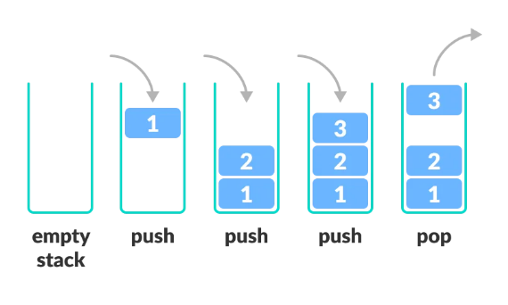
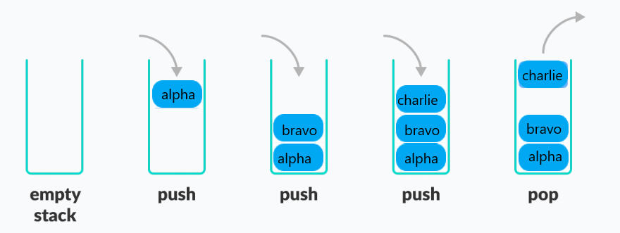

# **Stack**

A Stack is a data structure that is characterized as "Last In, Last Out" (LIFO). Stacks are a linear collection of items where the addition of new elements and the removal of existing elements takes place at the same end. 

You can think of this as when you stack plates on top of each other. The first one you set down, starts the stack and then once you place another plate on top, that first plate becomes the bottom/last one that would get picked up.

The most recent plate that is put on the stack would be the first one removed from the stack. If we wanted to remove the 3rd plate down, we would have to remove the first 2 plates from the top to then reach the 3rd plate.
Stacks allow us to store and retrieve data sequentially.

Stacks are an easy way to have an 'undo' feature. This allows a user to backtrack however far they need.

Best times to use stacks are when the main operations required are `push` and `pop` from the top of the stack.

When a stack is properly implemented, the O notation to append and delete elements is O(1). 

>O(1) means that the time it takes to execute the operation is constant regardless of the input’s size (the length of the stack).

As the picture below illustrates, when you put an item on top of a stack it is called 'push' and removing is called 'pop'.

<picture>
    <source media="(prefers-color-scheme: dark)" srcset="Stack_img.PNG">
  <source media="(prefers-color-scheme: light)" srcset="Stack_img.PNG">
  
</picture>


## **OPERATIONS OF A STACK**

Some of the basic operations are:
- Push
- Pop
- Empty
- Size
- Peek


`push()` adds the 'value' to the back of the stack.   
```python
my_stack.append(value)
```


`pop()` removes and returns the item from the back of the stack. This will also delete it from the list.
```python
value = my_stack.pop()
```


`is_empty()` returns true if the `len` of the stack is zero.
```python
if len(my_stack) == 0:
```


`size` returns the size of the stack using `len`.
```python
length = len(my_stack)
```


`peek` returns the topmost value of the stack using `[-1]`.
```python
return self.my_stack[-1]
```


## **IMPLEMENTING A STACK**

The built-in list structure can be used as a stack. Unfortunately list/stacks can run into speed issues as they grow. The items are stored next to each other in memory, so as the stack grows, the block of memory grows as well. This can lead to append() calls taking a bit more time than using other calls.


Writing a class called Stack
```python
class Stack:
    pass
```

Adding an empty list to the Stack Class with the name **alphabet**.
```python
class Stack:
    def __init__(self):
        self.alphabet = []
```

Now to `push` the letters into the stack, we will `append` to the 'alphabet' list. 
```python
class Stack:
	def __init__(self):
		self.alphabet = []

	def push(self, letters):
		self.alphabet.append(letters)
		return letters
```

To `pop` out the topmost element from the stack, we will `pop` from the list.
```python
class Stack:
	def __init__(self):
		self.alphabet = []

	def push(self, letters):
		self.alphabet.append(letters)
		return letters

    def pop(self)
        return self.alphabet.pop()
```

Now that our stack is implemented, we can view the stack through `len`, `peek`, and `is_empty`. Using then `len` method within how_many() will return the size of the stack.  peek() will return the last item of our list. is_empty() will check to see if the list is empty or not. 
```python
class Stack:
    def __init__(self):
        self.alphabet = []

    def push(self, letters):
        self.alphabet.append(letters)
        return letters

    def pop(self):
        return self.alphabet.pop()    

    def peek(self):
        return self.alphabet[-1]

    def how_many(self):
        length = len(self.alphabet)
        return length

    def is_empty(self):
        return len(self.alphabet) == 0
```

To test the stack operations, let's walk through an example.

1. Let's use the `push` method to `push` our letters to the alphabet stack:
```python
stack.push('Alpha')
stack.push('Bravo')
stack.push('Charlie')
```

2. Now we can check to see if the alphabet stack is empty:
```python
print(stack.is_empty())
# False
```

3. To see what letter is the topmost in our stack:
```python
print(stack.peek())
# Charlie
```

4. For checking the size of our stack, we will call the how_many() function:
```python
print(stack.how_many())   
# 3
```

5. To `pop` the topmost letters from the stack, we can use the `pop` method:
```python
stack.pop()             
# Now Charlie was popped off the stack
```

6. Let's see what element is at the top of the stack now using the peek():
```python
print(stack.peek())
# Bravo
```

7. To `pop` the rest of the list, we will `pop()` twice. If we were to try a third time on the empty list, we would run into an *IndexError: pop from empty list*:
```python
stack.pop()            # pop Bravo
stack.pop()            # pop Alpha
```

8. Finally we will check to see if our stack is now empty using `is_empty`:
```python
print(stack.is_empty())
# True
```

Here is an illustration of what the `push` and `pop` look like on the stack.

<picture>
    <source media="(prefers-color-scheme: dark)" srcset="stack_structure.PNG">
    <source media="(prefers-color-scheme: light)" srcset="stack_structure.PNG">
    
</picture>


## **EXAMPLE**
```python
def removeDuplicates(S):
    list_1 = []
    for i in S:
        if i not in list_1:
            list_1.append(i)
            
    return "".join(list_1)

# Test Code 
S = "bluebabybuggybumpers"
print(removeDuplicates(S))

# Output
# blueaygmprs
```


## **PROBLEM TO SOLVE**
```python
class  Stack_to_reverse  :
    # Create an empty stack.
    def __init__(self):
        self.alphabet = []
 
    # Return True for empty and False otherwise.
    def is_empty(self):
        return len(self.alphabet) == 0
 
    # Remove topmost element from stack.
    def pop(self):
        return self.alphabet.pop() 
 
    # Push element on top of stack.
    def push(self, letters):
        self.alphabet.append(letters)
        return letters
 
 
    # Function to reverse phrase
    def reverse(self, new_phrase):
        pass


your_letters = Stack_to_reverse()

phrase = 'BabyBuggyBumpers'
reversed_phrase = your_letters.reverse(phrase)

print(f"Reversed phrase is: {reversed_phrase}")
# Output:
# Reversed phrase is: srepmuBygguBybaB
```

[Stack_to_reverse Solution](stack_alphabet_solution.py)

[Back to Welcome page](welcome.md)
