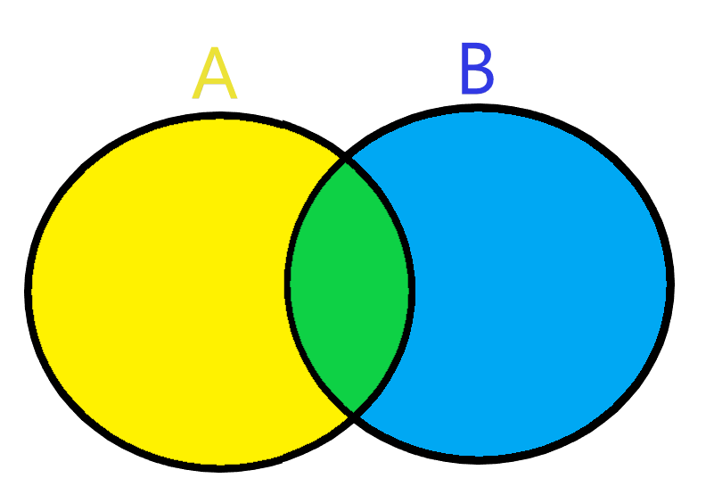

# **Set**

## **Introduction**
A **Set** is a data structure that is unordered and unindexed. There are no duplicates in a set. **Sets** can also contain data of all types: integer, float, and/or strings.

When a _`set()`_ is properly implemented, the O notation will be O(1) using the _`hashing`_ technique.

Best times to use a **Set** are when you are needing to eliminate duplicate entries, checking to see if an element is present in the dataset, or performing arithmetic operations such as union, intersection, finding the difference.


## **Creating Sets**
To create a **Set**, you place all the elements inside curly braces { }, separate by comma(s), or use the built-in _`set()`_ function.  


>Once a _`set`_ is created, you cannot change those elements, but you can add new elements.


Initialize a set:
```python
new_set = {1, 2, 3}

print(new_set)
# {1, 2, 3}
```

Add an element to a set:
```python
new_set.add(4)

print(new_set)
# {1, 2, 3, 4}
```

Add multiple elements to a set:
```python
new_set.update([5, 6, 7])

print(new_set)
# {1, 2, 3, 4, 5, 6, 7}
```

**Adding Sets Together**

If you have two sets you would like to combine, use the _`update()`_ method.

```python
old_set = {"A", "B", "C"}
new_set = {1, 2, 3}

old_set.update(new_set)

print(old_set)
# Your output may look different due to sets being unordered.
# {'C', 1, 'A', 'B', 2, 3}
```

**Add Any Iterable**

You are not relegated to only add sets to other sets. You can add a dictonary, list, tuple, etc. 
```python
old_set = {"A", "B", "C"}
new_set = [1, 2, 3]

old_set.update(new_set)

print(old_set)
# Output may be a different order
# {'B', 2, 1, 3, 'C', 'A'}
```

**To Remove an Element**

Use the _`remove()`_ or _`discard()`_ method. The difference between these two methods is that _`discard()`_ leaves the set unchanged if the element is not present. With _`remove()`_, this will raise an error is the element is not present.
```python
new_set = {1, 2, 3}

new_set.remove(1)

print(new_set)
# {2, 3}

new_set.discard(2)

print(new_set)
# {3}
```


## **Loops**
In accessing items in a _`set()`_  you cannot refer to an index or key, but you can loop through the set items. You can use a _`for`_ loop.

Looping through a set:
```python
dog_set = {"doberman", "newfoundland", "saint bernard"}

for x in dog_set:
    print(x)

# newfoundland
# saint bernard
# doberman
```

You can check to see if a "newfoundland" is present:

```python
dog_set = {"doberman", "newfoundland", "saint bernard"}

print("newfoundland" in dog_set)
# True
```


## **Comparing Sets**

**Joining Two Sets**

We already used the _`update()`_ method above, but there is also the _`union()`_ method which returns a new set containing all items from both sets.

```python
set_1 = {"A", "B" , "C"}
set_2 = {1, 2, 3}

set_3 = set_1.union(set_2)
print(set_3)
# Output may be a different order
# {1, 2, 'A', 3, 'C', 'B'}
```
>Both _`union()`_ and _`update()`_ will exclude any duplicates.

**Find Intersection**

Finding the intersection will return a new set with the element(s) that are common to both sets, you can use either the _`intersection()`_ method or the _`&`_ operator. Both will accomplish the same thing.
```python
A = {1, 2, 3, 4, 5, 6, 7}
B = {5, 6, 7, 8, 9, 10}

print(A & B)
# {5, 6, 7}
```
As illustrated in this image, the yellow circle is A and the blue circle is B. The middle where the circles overlap is green because that is the _`intersection()`_ or overlap where set A and B contain the same numbers and create a new set.

<picture>
    <source media="(prefers-color-scheme: dark)" srcset="Set_img.png">
  <source media="(prefers-color-scheme: light)" srcset="Set_img.png">
  
</picture>


**Finding Difference**

Finding the difference will return a new set with the element(s) that is the difference between two sets. You can use the _`difference()`_ method or the  **`-`**  operator.  

```python
set_A = {5, 10, 15, 20, 25, 30}
set_B = {10, 20, 30, 40}

print(set_A.difference(set_B))
# {25, 5, 15}
print(set_B.difference(set_A))
# {40}
```

_Explanation:_

`set_A.difference(set_B)` is showing the elements present in A, but not in B.

`set_B.difference(set_A)` is showing the elements present in B, but not in A.


**Symmetric Difference**

The output of the _`symmetric_difference()`_ is like the opposite of _`intersection()`_. It will show the elements present in either of the two sets, but not common in both the sets.

```python
set_A = {5, 10, 15, 20, 25, 30}
set_B = {10, 20, 30, 40}

print(set_A.symmetric_difference(set_B))
# {5, 40, 15, 25}
print(set_B.symmetric_difference(set_A))
# {5, 40, 25, 15}
```

Notice that it doesn't matter which set is first in the print statement. Both print statements contain the same elements because of how _`symmetric_difference()`_ works by showing the elements present in either set but not both.


## **Example**

```python
set_1 = {9,8,7,6,5,4,3,2,1}
set_2 = {9,7,6,5,4,2,6,1,0}

# Find if both sets have any common numbers
def common_number(set_1, set_2):
    if (set_1 & set_2):
        return True
    else:
        return False

print(common_number(set_1, set_2))
# True

# Print the numbers that are not in both sets  
print(set_1.symmetric_difference(set_2))
# {0, 3, 8}

# Print the numbers that are in both sets
print(set_1 & set_2)
# {1, 2, 4, 5, 6, 7, 9}
```


## **Problem to Solve**
```python
'''Grocery Problem'''
# Your output may print in a different order

groceries = {"apples", "bananas", "oranges", "milk", "salad", "beef", "soup"}
add_to_groceries = {"oranges", "beef", "chicken", "pineapple"}

# print the missing items from groceries
print("Missing food in add_to_groceries:",   )
# Missing values in second list: {'salad', 'soup', 'milk', 'bananas', 'apples'}


# print the additional groceries from add_to_groceries
print("Additional food to be added:",    )
# Missing values in second list: {'chicken', 'pineapple'}


# Combine both sets of food into a new set
new_groceries = 


# print new grocery set
print(new_groceries)
# {'soup', 'apples', 'salad', 'oranges', 'beef', 'pineapple', 'milk', 'bananas', 'chicken'}


# Add "kiwi" and "butter" to new_groceries


# Print new_groceries
print(new_groceries)
# {'beef', 'milk', 'oranges', 'butter', 'pineapple', 'kiwi', 'salad', 'chicken', 'bananas', 'apples', 'soup'}
```


[Grocery Solution](set_solution.py)


[Back to Welcome page](welcome.md)
